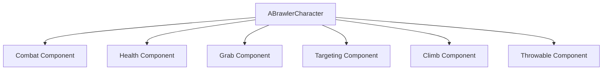
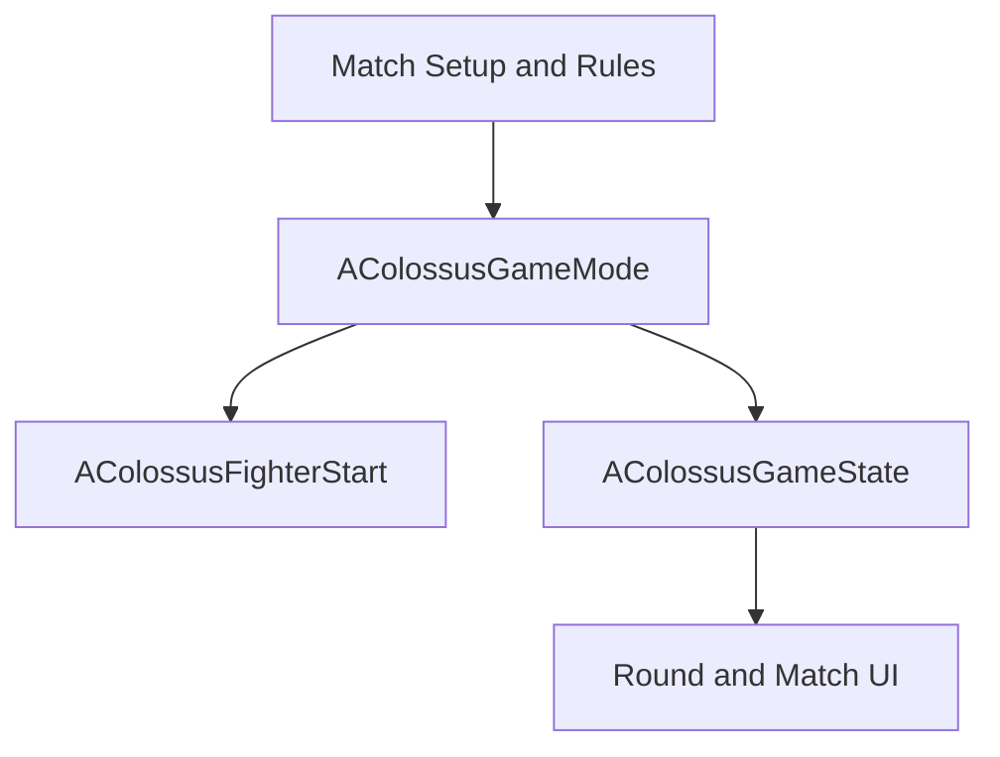

# Colossus Combat

**Unreal Engine 5.8 | C++ | Blueprints | Windows | Solo-developed prototype**

*Colossus Combat* is a third-person kaiju arena brawler built around weighty melee combat, vertical traversal, and physical interactions. Fighters can climb arena structures, use objects as weapons, grab and throw opponents, and weaponize defeated bodies.

This repository documents the gameplay architecture behind the prototype. The project is designed as a technical-design case study: gameplay rules are implemented through modular C++ components, exposed for Blueprint configuration, and organized so individual systems can be reused without rebuilding the character framework.

## Prototype Status

The current Unreal Engine 5.8 prototype includes:

- Light and heavy attacks with combo queuing.
- Blocking, hit reactions, knockback, stun, hit-stop, camera shake, and death states.
- Data-driven attack definitions with configurable damage, range, trace sockets, trace radius, reactions, knockback, and impact feedback.
- Lock-on targeting and combat-camera behavior.
- Grabbing, carrying, and throwing living opponents.
- Picking up and throwing defeated opponents through the existing death pipeline.
- Throwable arena objects with configurable attachment, velocity, damage, knockback, and impact behavior.
- Climbing and mantling on designated climbable surfaces.
- An AI-controlled opponent with pursuit, facing, attack selection, reactions, stun, damage, and death behavior.
- Health bars, round transitions, victory/defeat handling, restart flow, and controls UI.
- Configurable match rules and fighter spawn points.
- A packaged Windows prototype build.

The prototype uses placeholder and third-party assets while the gameplay framework is developed. Marketplace and Fab content that cannot be redistributed is excluded from this repository.

## Design Goals

### Reusable fighter systems

Combat features are separated into focused Actor Components rather than being concentrated in one character class. The same component architecture can support fighters with different bodies, attack sets, movement options, and interaction rules.

### Designer-facing configuration

Core behavior is implemented in C++, while tunable values and content-facing controls are exposed to Blueprints. Attacks, sockets, reactions, camera feedback, throw behavior, and other settings can be adjusted without rewriting the underlying gameplay logic.

### Physical arena interaction

The arena is intended to participate in combat. Climbing, grabbing, throwable objects, and defeated-body throws are part of the core interaction model rather than isolated scripted moments.

### Expandable match structure

Match rules, fighter spawning, match state, and UI updates are separated from the fighter framework. This allows additional match types to be introduced without rewriting the combat components.

## Gameplay Architecture

`ABrawlerCharacter` provides the shared fighter state model and owns the reusable fighter-domain components.

| System | Responsibility |
| --- | --- |
| `UBrawlerCombatComponent` | Attack selection, combo queuing, blocking, traces, hit deduplication, reactions, and impact feedback. |
| `UBrawlerHealthComponent` | Health, damage processing, blocking modifiers, knockback, reaction gating, death, and corpse pickup state. |
| `UBrawlerGrabComponent` | Target acquisition, pending and confirmed grabs, socket attachment, aiming, carrying, and throwing fighters or objects. |
| `UBrawlerTargetingComponent` | Living-target selection, lock-on state, combat-camera interpolation, and camera-center aim points. |
| `UBrawlerClimbComponent` | Climbable-surface detection, wall alignment, vertical movement, mantle checks, and mantle completion. |
| `UBrawlerThrowableComponent` | Pickup state, attachment offsets, flight behavior, impact damage, knockback, reactions, and thrower immunity. |

The fighter uses explicit gameplay states including Idle, Attacking, Blocking, Stunned, Grabbing, Grabbed, Throwing, Climbing, Mantling, and Dead. State checks prevent incompatible actions from competing for control of movement, animation, or collision.

## Data-Driven Combat

Attacks are defined through `FBrawlerAttackData` rather than hard-coded as separate character functions. Each definition can specify:

- Attack name and animation montage.
- Trace start and end sockets.
- Trace radius and effective range.
- Damage and knockback.
- Reaction type.
- Camera shake, hit-stop, and impact audio.

During an active attack, the combat component performs a sphere sweep between the configured sockets. A per-attack set prevents the same target from receiving repeated damage from multiple trace calls during one attack window.

This structure separates combat tuning from the fighter class. Different fighters can supply different attack definitions while continuing to use the same execution, tracing, damage, and feedback systems.

## Grabbing and Throwing

The grabbing framework handles both brawlers and physics-based arena objects.

The system supports:

- Searching for valid fighters before nearby throwable objects.
- Animation-timed confirmation of grabs and throws.
- Separate attachment sockets and per-object grip offsets.
- Temporarily disabling movement and collision while a fighter is held.
- Lock-on, camera-aimed, and forward-direction throw targeting.
- Upward arc bias for readable long-distance throws.
- Different recovery behavior for living fighters and defeated bodies.
- Restoring physics, collision, and pickup availability after an object is released.

Throwable objects bind to collision events while in flight, ignore their thrower, and apply their configured damage and reaction once per throw. This allows the same interaction flow to support arena debris, weapons, and defeated opponents.

## Climbing and Targeting

The climbing component detects tagged climbable surfaces, aligns the fighter to the contacted wall, switches movement into a climbing mode, and checks for a valid mantle when the fighter reaches the top.

The targeting component selects the nearest living opponent within range and manages the combat-camera transition. It also supplies camera-center aim points for thrown fighters and objects, keeping targeting and physical interactions on the same aiming framework.

## Enemy AI

The prototype opponent uses an AI controller with Behavior Tree and Blackboard decision support. Its current responsibilities include:

- Acquiring and pursuing the player.
- Stopping movement while attacking, stunned, grabbed, or dead.
- Rotating toward the target before committing to an attack.
- Selecting attacks according to distance and cooldown state.
- Respecting fighter state, attack range, and facing requirements.
- Participating in the same damage, reaction, stun, and death systems as the player.

The current AI proves the combat loop but is not intended to represent final production depth. Greater attack variety, clearer tactical behavior, and more robust target selection remain future work.

## Match Framework

Project-wide match responsibilities are separated from reusable fighter mechanics.

| Class | Responsibility |
| --- | --- |
| `AColossusGameMode` | Match orchestration, fighter spawning, start selection, and win-condition evaluation. |
| `AColossusGameState` | Match-visible state such as active rules, round progress, and match completion. |
| `AColossusFighterStart` | Explicit fighter-start locations used by player and AI spawning. |

The prototype currently supports a two-round player-versus-AI match with health updates, between-round resets, victory and defeat presentation, and restart handling. Win conditions and match settings are being organized as configurable rules so future modes do not have to duplicate the existing combat loop.

Networked multiplayer is not currently presented as a finished feature. The GameMode/GameState separation establishes clearer ownership for future multiplayer work without treating the current prototype as network-ready.

## C++ and Blueprint Responsibilities

| C++ | Blueprints and editor content |
| --- | --- |
| Shared fighter states and action validation. | Assigning animation montages and attack content. |
| Combat, health, targeting, grabbing, climbing, and throwable behavior. | Configuring exposed component settings, sockets, reactions, and feedback. |
| Attack data structures and trace logic. | Animation Notify timing for attack, grab, and throw windows. |
| Damage, knockback, hit deduplication, and death handling. | Fighter-specific presentation and content setup. |
| AI controller and decision support. | Behavior Tree and Blackboard configuration. |
| GameMode, GameState, and fighter-start framework. | HUD presentation, arena composition, audio, and prototype VFX. |

This division keeps low-level rules consistent while allowing gameplay content to be assembled and tuned through Unreal's editor-facing workflow.

## Iteration and Debugging

The prototype has been developed through repeated playable milestones rather than as isolated code samples. Examples of system-level iteration include:

- Correcting round-two health initialization so increased maximum health is reflected accurately in current health and the HUD.
- Stabilizing corpse and object attachment by separating fighter and throwable sockets and exposing grip offsets.
- Preventing repeated damage during one attack or throw through explicit hit tracking.
- Separating match-wide state from fighter logic through the GameMode/GameState refactor.
- Replacing generic spawn targets with dedicated fighter-start actors.
- Reducing repeated heavy-attack behavior by adding attack selection and cooldown constraints.
- Debugging interactions between movement, animation, collision, AI, combat state, and UI rather than treating each feature as an isolated mechanic.

## Current Limitations

This is a gameplay prototype, not a production release.

- Characters, animations, environments, audio, and effects include non-final assets.
- AI behavior is functional but still limited in variety and tactical depth.
- Camera, targeting, UI, audio mixing, and combat feedback need additional polish.
- Throwable attachment and collision behavior require continued regression testing across different bodies and objects.
- Climbing and mantling need broader geometry and collision testing.
- Controller support, accessibility, optimization, and full QA passes are incomplete.
- Local and online multiplayer are planned possibilities, not demonstrated features of the current build.
- The audience-favor system, corporation metagame, final roster, and large-scale environmental destruction are future design goals rather than implemented prototype features.

## Repository Notes

- Engine version: Unreal Engine 5.8.
- Internal project/module name: `KaijuPrototype`.
- Current public project name: *Colossus Combat*.
- The project is developed solo by Alex Davis under the Mythwell Studio label.
- Third-party Marketplace and Fab assets are excluded from the public repository.
- A packaged Windows prototype has been produced separately from the source repository.

## About the Developer

Alex Davis is a technical game designer and Unreal Engine developer focused on modular gameplay systems, C++/Blueprint integration, rapid prototyping, and narrative-driven game development.

- [Portfolio](https://alexsfantasyworld.wixsite.com/portfolio)
- [GitHub profile](https://github.com/MythwellDev)
- [Playable prototypes](https://mythwellstudio.itch.io/)
